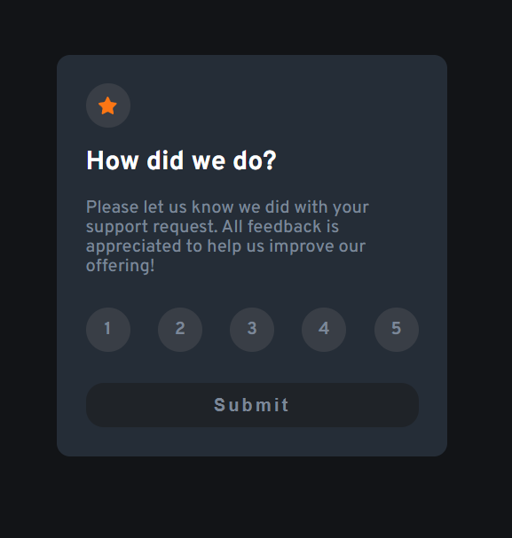

## Table of contents

- [Overview](#overview)
  - [Features](#features)
  - [Screenshot](#screenshot)
  - [Links](#links)
  - [Built with](#built-with)
- [Author](#author)
- [Acknowledgments](#acknowledgments)

## Overview

### Features

A modern and responsive UI element built with React, Typescript, and Sass. It provides users with an interactive way to rate a product or service with a scale of 1 to 5. The component is highly reusable, making it a great addition to any React-based application. To ensure its quality and reliability, the component have been thoroughly tested with the vitest library.

### Screenshot

### Links

- Live Site URL: [Vercel](https://interactive-rating-component-sable-ten.vercel.app/)

### Built with

The app was built using a number of different technologies and tools, including:

- [Vite]("https://vitejs.dev/"): a fast build tool that allows for rapid development and quick feedback loops
- [TypeScript]("https://www.typescriptlang.org/"): a statically-typed superset of JavaScript that provides better code reliability and improved tooling
- [React]("https://react.dev/"): a popular JavaScript library for building user interfaces
- [Sass]("https://sass-lang.com/"): a preprocessor scripting language that extends CSS and provides more features and flexibility
- [Vitest]("https://vitest.dev/"): a testing library specifically designed for use with Vite and Vue applications
- [React Testing Library]("https://testing-library.com/"): a testing utility for React that allows for easy and efficient testing of UI components
- [React Icons]("https://react-icons.github.io/react-icons/"): a library for modern looking icons

## Author

Cosmin Bozai

## Acknowledgments

This is a solution to the [Interactive rating component challenge on Frontend Mentor](https://www.frontendmentor.io/challenges/interactive-rating-component-koxpeBUmI).
